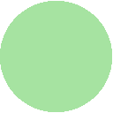

# catppuccin-waybar

Catppuccino-Waybar 🐱 is a streamlined Linux status bar 🖥️, perfect for the Catppuccino theme. Personalize it to display key system info and notifications for a cohesive desktop experience.

## Preview


## Colorpalette

### 🌿 Mocha

|                                              | labels   | Hex                  | RGB                             | HSL                             |
| -------------------------------------------- | -------- | -------------------- | ------------------------------- | ------------------------------- |
|      | Base     | <code>#1e1e2e</code> | <code>rgb(30, 30, 46)</code>    | <code>hsl(240, 21%, 15%)</code> |
|  | Surface0 | <code>#313244</code> | <code>rgb(49, 50, 68)</code>    | <code>hsl(237, 16%, 23%)</code> |
|      | Text     | <code>#cdd6f4</code> | <code>rgb(205, 214, 244)</code> | <code>hsl(226, 64%, 88%)</code> |
|  | Lavender | <code>#b4befe</code> | <code>rgb(180, 190, 254)</code> | <code>hsl(232, 97%, 85%)</code> |
|     | Mauve    | <code>#cba6f7</code> | <code>rgb(203, 166, 247)</code> | <code>hsl(267, 84%, 81%)</code> |
|      | Teal     | <code>#94e2d5</code> | <code>rgb(148, 226, 213)</code> | <code>hsl(170, 57%, 73%)</code> |
|    | Maroon   | <code>#eba0ac</code> | <code>rgb(235, 160, 172)</code> | <code>hsl(350, 65%, 77%)</code> |
|     | Green    | <code>#a6e3a1</code> | <code>rgb(166, 227, 161)</code> | <code>hsl(115, 54%, 76%)</code> |
|     | Peach    | <code>#fab387</code> | <code>rgb(250, 179, 135)</code> | <code>hsl(23, 92%, 75%)</code>  |
|      | Blue     | <code>#89b4fa</code> | <code>rgb(137, 180, 250)</code> | <code>hsl(217, 92%, 76%)</code> |
|    | Yellow   | <code>#f9e2af</code> | <code>rgb(249, 226, 175)</code> | <code>hsl(41, 86%, 83%)</code>  |

## Features

- Seamless integration with Catppuccino theme 🎨
- Easily customizable for a personalized desktop experience ⚙️
- Easy to install 🚀

## Installation

1. Clone the repository:

   ```bash
   git clone https://github.com/your-username/catppuccin-waybar.git
   ```

2. Navigate to the project directory:

   ```bash
   cd catppuccin-waybar/waybar
   ```

3. Copy the config to your .config folder

   ```bash
   cp -r * ~/.config/waybar
   ```

## Usage

1. Run Waybar:

   ```bash
   waybar
   ```

## Contributing

Contributions are welcome! Feel free to open issues or submit pull requests.

## License

This project is licensed under the [MIT License](LICENSE).
